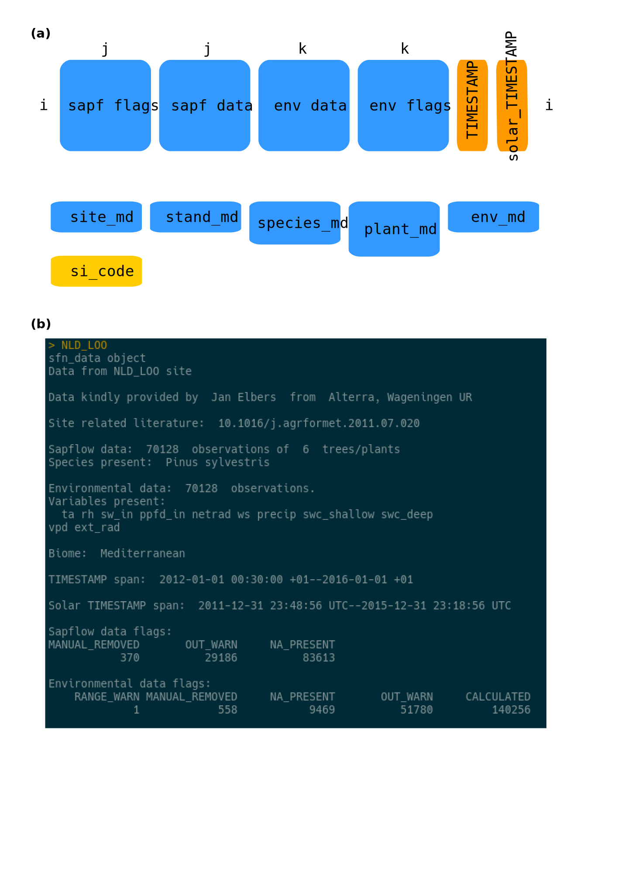
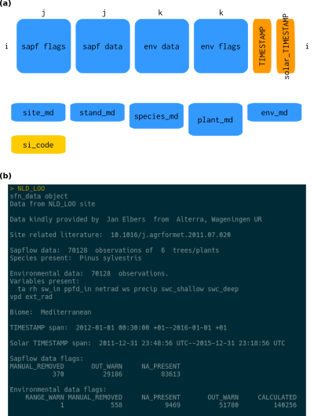

## Table captions

**Table S1** Data checks implemented in the first level of data quality control
(QC1).

**Table S2.** Description of site metadata variables.

**Table S3.** Description of stand metadata variables.

**Table S4.** Description of species metadata variables.

**Table S5.** Description of plant metadata variables.

**Table S6.** Description of environmental metadata variables.

**Table S7.** Data checks implemented in the second level of data quality control
(QC2).

**Table S8.** Datasets in the SAPFLUXNET database identified by numeric code, 
dataset code and site name. Number of species per dataset, geographic coordinates 
and elevation are also shown. Negative coordinate values are shown for Southern 
and Western Hemispheres.

**Table S9.** Number of plants and number of datasets for each species present 
in the SAPFLUXNET database.

**Table S10.** Number of plants per genus present in the SAPFLUXNET database.


## Figure captions

**Figure S1.** Overview of the data QC process, showing file management and 
identifying automatic (in yellow) and manual steps (in red).  The column on 
the left shows the different updates of the status file for each dataset and 
the column on the right shows generated data reports and steps requiring 
feedback or manual changes. 

**Table S1** Data checks implemented in the first level of data quality control
(QC1).

**Figure S2.** (a) Structure of sfn_data objects, which are based on the S4 class. 
Boxes in the figure represent different slots where data are stored.
Each object is identified by the 'si_code', stored as a slot in the object, 
with the format of a character vector. Slots storing time series of data and the 
associated data flags are of class 'tibble' and have all the same number of 
rows (*i*), corresponding to the the number of timesteps in the dataset and 
labelled with two POSIXct timestamp vectors (TIMESTAMP, solar_TIMESTAMP).The slot 
storing sap flow data, 'sapf_data' contains(*j*) columns and environmental data 
('env_data') contains *k* columns, corresponding to the number of environmental 
variables present. Slots with the suffix 'md' refer to the different metadata and all are objects of
class 'tibble' with different dimensions. For example, the number of rows in
'plant_md' depends on the number of plants in the dataset (and this is depicted by the different 
length of the box). More information on
the 'sfn_data' class objects can be found in the vignette 'sfn-data-classes' of the 
package [sapfluxnetr](https://github.com/sapfluxnet/sapfluxnetr).  
(b) Summary of an sfn_data object, showing highlights of site metadata, data
dimensions, timestamp span and flags present on the data.


**Figure S3.** Example screenshot of the app used for handling outliers and out of range values
in time series. The left column shows dataset and variable selection. The central part
shows the time series, with out of range values in red and possible outliers in yellow.
Rows to replace or remove are selected in a table and written to a text file when done.


**Figure S4.** Detailed geographic distribution of SAPFLUXNET datasets. Datasets are 
labelled by dataset number in Table S4. Woodland area from Crowther et al. (2015) shown in green.


```{r setup, include=FALSE}
knitr::opts_chunk$set(echo = TRUE)
library(raster)
library(flextable)
library(pander)
library(magrittr)
library(readxl)
library(tidyverse)
library(ggrepel)
library(cowplot)
library(ggspatial)

source('metadata_wrangling.R')
load('maps_base.RData')
```


\pagebreak

```{r fig_QC, echo=FALSE,  out.height="800px",fig.align='center', fig.cap='Figure S1. Overview of the data QC process'}
# Doesn't work for Word visualisation
#knitr::include_graphics('resources/QC_summary2.svg')

knitr::include_graphics('resources/QC_summary2.png')

```
**Figure S1.**


\pagebreak

```{r table_QC1, echo=FALSE,results='asis'}

readxl::read_xlsx('resources/table_QC1_checks.xlsx',1) %>% 
   qflextable() %>%  
  bold( i = 1,  part = "header") %>%
    fontsize(size=10,part='body') %>% 
  align(part='header',align='left') %>% 
   set_caption('Table S1') %>% 
  width(width=c(1.8,5)) %>%
  height(height=c(0.4,0.6,0.2,0.7,0.4,0.4,0.2,0.4,0.4,0.4,0.2))
```
\pagebreak

```{r fig_sfn_data, echo=FALSE,  out.height="800px",fig.align='center', fig.cap='Figure S2. Structure of sfn_data objects'}
# Doesn't work for Word visualisation
# 


```
**Figure S2.**

\pagebreak


```{r tab_sitemd, echo=FALSE, results='asis'}
                              
sapfluxnetr:::.metadata_architecture() %>%
  magrittr::extract2(., 'site_md') %>%
  purrr::map_dfr(magrittr::extract, c('description', 'type', 'units')) %>%
  dplyr::mutate(
    variable = sapfluxnetr:::.metadata_architecture() %>%
      magrittr::extract2(., 'site_md') %>%
      names()
  ) %>%
  dplyr::select(variable, everything()) %>% 
  qflextable() %>%
   bold( i = 1,  part = "header") %>%
    fontsize(size=10,part='body') %>% 
  set_header_labels(
    variable = 'Variable',
    description= 'Description',
    type= 'Type',
    units= 'Units') %>% 
   set_caption('Table S2') %>% 
  width(width=c(1.8,2.5,1.2,1.2)) %>%
  align(part='header',align='left') %>% 
    align(part='body',align='left') %>% 
  height(height=c(0.4,rep(0.2,5),0.4,0.4,0.2,0.2,0.6,0.6,0.2,0.6,0.7,0.4,0.6,0.6,0.6, # 19
                  0.6,0.6,0.4,0.6))

```
\pagebreak

```{r tab_standmd, echo=FALSE, results='asis'}
                              
sapfluxnetr:::.metadata_architecture() %>%
  magrittr::extract2(., 'stand_md') %>%
  purrr::map_dfr(magrittr::extract, c('description', 'type', 'units')) %>%
  dplyr::mutate(
    variable = sapfluxnetr:::.metadata_architecture() %>%
      magrittr::extract2(., 'stand_md') %>%
      names()
  )  %>%
  dplyr::select(variable, everything()) %>% 
  qflextable() %>%
   bold( i = 1,  part = "header") %>%
    fontsize(size=10,part='body') %>% 
  set_header_labels(
    variable = 'Variable',
    description= 'Description',
    type= 'Type',
    units= 'Units') %>% 
   set_caption('Table S3') %>% 
  width(width=c(1.8,2.5,1.2,1.2)) %>%
   align(part='header',align='left') %>% 
    align(part='body',align='left') %>% 
  height(height=c(0.4,0.6,0.4,0.6,0.4,0.6,0.2,0.2,0.2,0.4,0.4,0.2,0.2,
                  0.4,0.2,0.2,0.2))
```
\pagebreak

```{r tab_speciesmd, echo=FALSE, results='asis'}
                              
sapfluxnetr:::.metadata_architecture() %>%
  magrittr::extract2(., 'species_md') %>%
  purrr::map_dfr(magrittr::extract, c('description', 'type', 'units')) %>%
  dplyr::mutate(
    variable = sapfluxnetr:::.metadata_architecture() %>%
      magrittr::extract2(., 'species_md') %>%
      names()
  ) %>%
  select(variable, everything()) %>% 
  qflextable() %>%
   bold( i = 1,  part = "header") %>%
    fontsize(size=10,part='body') %>% 
  set_header_labels(
    variable = 'Variable',
    description= 'Description',
    type= 'Type',
    units= 'Units') %>% 
     align(part='header',align='left') %>% 
    align(part='body',align='left') %>% 
   set_caption('Table S4') %>% 
  width(width=c(1.8,2.5,1.2,1.2)) %>%
  height(height=c(0.9,0.4,0.6,0.4))
```
\pagebreak

```{r tab_plantmd, echo=FALSE, results='asis'}
                              
sapfluxnetr:::.metadata_architecture() %>%
  magrittr::extract2(., 'plant_md') %>%
  purrr::map_dfr(magrittr::extract, c('description', 'type', 'units')) %>%
  dplyr::mutate(
    variable = sapfluxnetr:::.metadata_architecture() %>%
      magrittr::extract2(., 'plant_md') %>%
      names()
  ) %>%
  select(variable, everything()) %>% 
  qflextable() %>%
   bold( i = 1,  part = "header") %>%
    fontsize(size=10,part='body') %>% 
  set_header_labels(
    variable = 'Variable',
    description= 'Description',
    type= 'Type',
    units= 'Units') %>% 
  align(part='header',align='left') %>% 
    align(part='body',align='left') %>% 
   set_caption('Table S5') %>% 
  width(width=c(1.8,2.5,1.2,1.2)) %>%
  height(height=c(0.4,0.6,0.4,0.6,0.2,0.4,0.2,0.4,0.2, #53
                  0.2,0.4,0.2,0.4,0.2,0.4,0.4,0.4,0.4,0.4,0.6,0.4,0.4,0.4,0.4,0.4))
```
\pagebreak


```{r tab_envmd, echo=FALSE, results='asis'}
                              
sapfluxnetr:::.metadata_architecture() %>%
  magrittr::extract2(., 'env_md') %>%
  purrr::map_dfr(magrittr::extract, c('description', 'type', 'units')) %>%
  dplyr::mutate(
    variable = sapfluxnetr:::.metadata_architecture() %>%
      magrittr::extract2(., 'env_md') %>%
      names()
  ) %>%
  select(variable, everything()) %>% 
  qflextable() %>%
   bold( i = 1,  part = "header") %>%
    fontsize(size=10,part='body') %>% 
  set_header_labels(
    variable = 'Variable',
    description= 'Description',
    type= 'Type',
    units= 'Units') %>% 
    align(part='header',align='left') %>% 
    align(part='body',align='left') %>% 
   set_caption('Table S6') %>% 
  width(width=c(1.8,2.25,1.2,1.2)) %>%
  height(height=c(0.4,0.4,0.4,0.4,0.4,0.4,0.4,0.6,0.4,0.2,0.4,0.4,0.4,0.6,0.4,0.7))
```
\pagebreak

```{r table_QC2, echo=FALSE,results='asis'}

readxl::read_xlsx('resources/table_QC2_checks.xlsx',1) %>% 
   qflextable() %>%  
  bold( i = 1,  part = "header") %>%
    fontsize(size=10,part='body') %>% 
  align(part='header',align='left') %>% 
    align(part='body',align='left') %>% 
  width(width=c(1.8,5)) %>%
  height(height=c(rep(0.5,6),0.7)) %>% 
   set_caption('Table S7')
```

\pagebreak

```{r fig_outliers_app, echo=FALSE,  out.height="800px", fig.cap='Figure S3. Screenshot of the data cleaning app'}

knitr::include_graphics('resources/out_app.png')
```
**Figure S3.**

\pagebreak

```{r tab_sites, echo=FALSE, message=FALSE, warning=FALSE, paged.print=FALSE, results="asis"}

sfn_sites_nspecies %>% 
  left_join(sfn_allsites %>% dplyr::select(si_code,si_name,si_elev)) %>% 
  mutate(country=sapply(strsplit(si_code,"_"),"[[",1),
         si_elev=as.integer(si_elev),
         num_code = as.integer(factor(si_code)))%>% 
  mutate_at(vars(si_lat,si_long),round,2) %>% 
  dplyr::select(num_code,si_code,si_name,si_lat, si_long,si_elev,nspecies) %>% 
  qflextable() %>%
   bold( i = 1,  part = "header") %>%
   fontsize(size=10,part='body') %>% 
   flextable::set_header_labels(
     num_code='#',
     si_code='Dataset code',
     si_name='Site name',
     si_lat='Lat.',
     si_long='Long.',
     si_elev='Elev.\n (m)',
     nspecies='N spp.') %>% 
  width(width=c(0.4,1.7,2.5,0.6,0.6,0.6,0.6)) %>%
  height(height=c(rep(0.2,176),rep(0.4,3),rep(0.2,23))) %>% 
   set_caption('Table S8')

```

\pagebreak

```{r regional_maps,fig.height=18, fig.width=15, cache=TRUE,echo=FALSE, message=FALSE, warning=FALSE,fig.cap='Figure S4. Detailed geographic distribution of SAPFLUXNET datasets'}

source('R/sfn_datapaper_functions.R')
# a) Site labels 

# b) Select countries to plot 

countries_sfn <- unique(sapply(strsplit(sfn_allsites$si_code,"_"),"[[",1))
countries_label <- c('ARG','BRA','COL','CRI','CHN','GUF','IDN','ISR','JPN','KOR','MDG','MEX','NZL','RUS','SEN','THA','UZB')
countries_europe <- c('AUT','CHE','CZE','DEU','ESP','FIN','FRA','GBR','HUN','ITA','NLD','PRT','SWE')
countries_america <- c('CAN','USA')
countries_austral <- c('AUS')
countries_africa <- c('MDG','ZAF')


# c) Add numeric codes 

sfn_allsites_country<- sfn_allsites %>% 
  mutate(country=sapply(strsplit(si_code,"_"),"[[",1),
         num_code = as.integer(factor(si_code)))


sfn_allsites_country %>% 
  dplyr::filter(country%in%countries_europe | si_code%in%c('RUS_FYO')) %>% 
  dplyr::filter(si_code%ni%c('ESP_LAS','FIN_PET')) -> sfn_sites_europe


sfn_allsites_country %>% 
  dplyr::filter(country%in%countries_label 
                | si_code%in%c('ESP_LAS','FIN_PET','USA_BNZ_BLA','AUS_KAR')) -> sfn_sites_world

sfn_allsites_country %>% 
  dplyr::filter(country%in%countries_america & si_code%ni%c('USA_BNZ_BLA')) -> sfn_sites_america 

# 3. Map, numeric codes, ggrepel not aligned ------------------------------------------------------

# world
sfnsites_world_dr <- globforest_rec_0_1  +
  geom_point(data=sfn_allsites,aes(x=si_long,y=si_lat),shape=21,color='black',fill='royalblue',alpha=0.5)+
  geom_text_repel(data = sfn_sites_world, 
                  aes(si_long, si_lat, label = num_code), size = 3,
                  segment.alpha=0.5,  nudge_x = -0.35,direction = "both",
                  box.padding = unit(0.1, 'lines'), force = 0.5)+geom_label_repel()+guides(fill='none')+xlab(NULL)+ylab(NULL)

# europe
sfnsites_europe_dr<- globforest_rec_0_1  +
  geom_point(data=sfn_allsites,aes(x=si_long,y=si_lat),shape=21,color='black',fill='royalblue',alpha=0.5)+
  geom_text_repel(data = sfn_sites_europe, 
                  aes(si_long, si_lat, label = num_code), size = 3,
                  segment.alpha=0.5,  nudge_y = -0.35,direction = "both",
                  box.padding = unit(0.1, 'lines'), force = 0.5)+
  coord_sf(xlim = c(-20, 40), ylim = c(32, 67), expand = FALSE)+
  geom_label_repel()+guides(fill='none')+xlab(NULL)+ylab(NULL)

# america
sfnsites_america_dr<- globforest_rec_0_1  +
  geom_point(data=sfn_allsites,aes(x=si_long,y=si_lat),shape=21,color='black',fill='royalblue',alpha=0.5)+
  geom_text_repel(data = sfn_sites_america, 
                  aes(si_long, si_lat, label = num_code), size = 3,
                  segment.alpha=0.5,  nudge_x = -0.35,direction = "both",
                  box.padding = unit(0.1, 'lines'), force = 0.5)+
  coord_sf(xlim = c(-130, -60), ylim = c(30, 55), expand = FALSE)+
  geom_label_repel()+guides(fill='none')+xlab(NULL)+ylab(NULL)

# austral
sfnsites_austral_dr<- globforest_rec_0_1  +
  geom_point(data=sfn_allsites,aes(x=si_long,y=si_lat),shape=21,color='black',fill='royalblue',alpha=0.5)+
  geom_text_repel(data = subset(sfn_allsites_country,country%in%countries_austral), 
                  aes(si_long, si_lat, label = num_code), size = 3,
                  segment.alpha=0.5,  nudge_x = -0.35,
                  box.padding = unit(0.1, 'lines'), force = 0.5)+
  coord_sf(xlim = c(110, 155), ylim = c(-45, -10), expand = FALSE)+
  geom_label_repel()+guides(fill='none')+xlab(NULL)+ylab(NULL)

# africa
sfnsites_africa_dr<- globforest_rec_0_1  +
  geom_point(data=sfn_allsites,aes(x=si_long,y=si_lat),shape=21,color='black',fill='royalblue',alpha=0.5)+
  geom_text_repel(data = subset(sfn_allsites_country,country%in%countries_africa), aes(si_long, si_lat, label = num_code), size = 3,
                  box.padding = unit(0.1, 'lines'), force = 0.5)+
  coord_sf(xlim = c(10, 50), ylim = c(-40, -10), expand = FALSE)+
  geom_label_repel()+guides(fill='none')+xlab(NULL)+ylab(NULL)


# e) Build figure 

plot_grid(
  plot_grid(sfnsites_world_dr,ncol=1,nrow=1,labels=c('a)')),
  plot_grid(sfnsites_europe_dr,sfnsites_austral_dr,ncol=2,nrow=1,rel_widths=c(1,0.7),labels=c('b)','c)')), #problem here?
  plot_grid(sfnsites_america_dr,sfnsites_africa_dr,ncol=2,nrow=1,rel_widths=c(1,0.7),labels=c('d)','e)')),
  nrow=3,rel_heights=c(1,1,0.7))


```
**Figure S4.**

\pagebreak

```{r tab_ntrees_species, echo=FALSE, message=FALSE, warning=FALSE, paged.print=TRUE, results="asis"}

sfn_species_ntrees %>% 
  left_join(sfn_nspecies_dataset,by=c('species'='sp_name')) %>% 
  dplyr::select(species,n_trees,n_sites) -> sfn_species_ntrees_reduced

data.frame(sfn_species_ntrees_reduced[1:58,],
          sfn_species_ntrees_reduced[59:116,],
           sfn_species_ntrees_reduced[117:174,])%>% 

  flextable::qflextable() %>% 
  flextable::autofit(add_w=0,add_h=0) %>%
  flextable::set_header_labels(
    species='Species',
    n_trees= 'N plant',
    n_sites= 'N data',
    species.1='Species',
    n_trees.1= 'N plant',
    n_sites.1= 'N data',
    species.2='Species',
    n_trees.2= 'N plant',
    n_sites.2= 'N data') %>% 
  flextable::bold( i = 1,  part = "header") %>% 
  fontsize(size=10,part='body') %>% 
  italic(j=c(1,4,7)) %>% 
  height(height=c(rep(.2,7),0.4,rep(.2,6),0.4,rep(.2,26),0.4,rep(.2,16))) %>% 
  width(width=c(1.3,0.6,0.5,1.3,0.6,0.5,1.3,0.6,0.5)) %>% 
  flextable::set_caption('Table S9')

```


\pagebreak
```{r tab_ntrees_genus, echo=FALSE, message=FALSE, warning=FALSE, paged.print=TRUE, results="asis"}

data.frame(sfn_genus_ntrees[1:32,],
          sfn_genus_ntrees[33:64,],
        rbind(sfn_genus_ntrees[65:95,],as_tibble_row(c(genus_f=NA,n_trees=''))))%>% 
  qflextable() %>% 
  autofit(add_w=0,add_h=0) %>%
  set_header_labels(
    genus_f= 'Genus',
    n_trees = 'N plants',
    genus_f.1= 'Genus',
    n_trees.1 = 'N plants',
    genus_f.2= 'Genus',
    n_trees.2 = 'N plants') %>% 
   bold( i = 1,  part = "header") %>% 
  fontsize(size=10,part='body') %>% 
  italic(j=c(1,3,5)) %>% 
  height(height=.2) %>% 
 flextable::set_caption('Table S10')

```
\pagebreak

